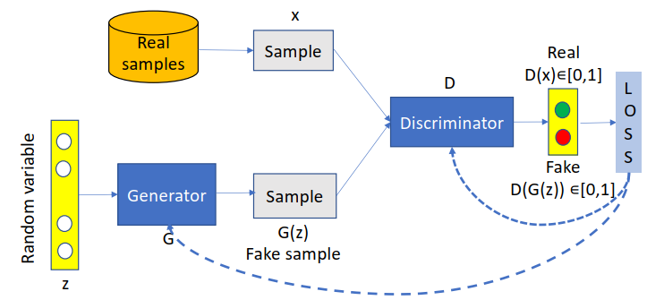
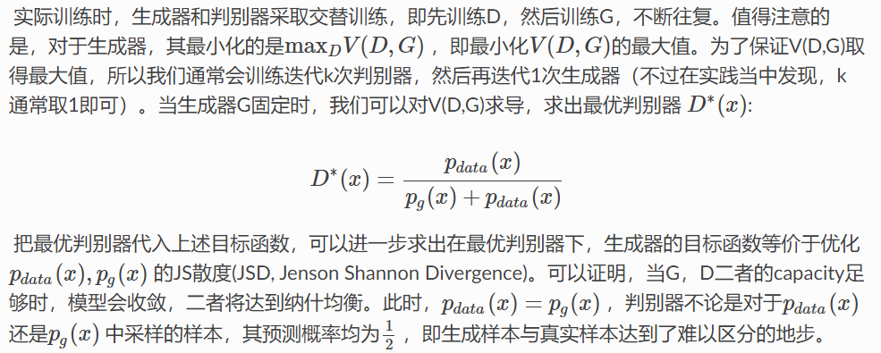

# GAN(Generative Adversarial Network)

GAN是一种深度学习模型，它由生成器和判别器组成。生成器是一个网络，它可以生成新的样本，而判别器是一个网络，它可以判断输入的样本是真实的还是生成的。

生成器的目标是生成尽可能真实的样本，而判别器的目标是尽可能地区分真实样本和生成样本。

生成器和判别器的训练过程是相互博弈的，生成器希望生成的样本被判别器认为是真实的，而判别器希望生成器生成的样本被认为是假的。

GAN的训练过程可以分为两个阶段：

1. 训练生成器：生成器的目标是生成尽可能真实的样本，所以我们希望它生成的样本被判别器认为是真实的，即希望生成器的损失函数尽可能小。

2. 训练判别器：判别器的目标是尽可能地区分真实样本和生成样本，所以我们希望它判断生成器生成的样本被认为是假的，即希望判别器的损失函数尽可能大。

# Discriminative model D (Discriminator)
- given a sample X, predict a label Y and estimate P(Y|X)
- classification in GAN (0 fake, 1 real)

# Generative model G (Generator)
• trained on sample X from a real distribution R
• when given some standard random distribution Z,
produce a distribution F which is closed to the real
distribution R

# Loss Function 
GAN的训练过程可以用下面的公式表示：

$$
\min_G \max_D V(D,G) = \mathbb{E}_{x\sim p_{data}(x)}[\log D(x)] + \mathbb{E}_{z\sim p_{noise}(z)}[\log(1-D(G(z)))]
$$

其中，$D$和$G$分别是判别器和生成器，$p_{data}$和$p_{noise}$分别是真实数据分布和噪声分布。

GAN的损失函数由两部分组成：

1. 判别器的损失函数：

$$
\max_D V(D,G) = \mathbb{E}_{x\sim p_{data}(x)}[\log D(x)] + \mathbb{E}_{z\sim p_{noise}(z)}[\log(1-D(G(z)))]
$$

2. 生成器的损失函数：

$$
\min_G V(D,G) = \mathbb{E}_{z\sim p_{noise}(z)}[1-\log D(G(z))]
$$

一开始D(G(z)) 很小，使得loss梯度更新小，训练慢。

因此我们不用1-D(G(z))，上面的loss等价于
$$
\max_G V(D,G) = \mathbb{E}_{z\sim p_{noise}(z)}[\log D(G(z))]
$$

# 推导
给定数据分布$p_{data}(x)$，对其采样得到的是训练数据，生成器$G$的目标是生成分布$p_{data}(x)$的样本，使得这些样本和训练数据尽可能相似，也就是生成器的分布$p_{g}(x)$尽可能接近$p_{data}(x)$。

通过生成器$G$，我们可以得到一个分布$p_{g}(x)=p_g(x;\theta)$, 其由参数$\theta$决定。我们可以使用最大似然估计：
$\log L=\displaystyle \sum_1^m\log p_g(x_i;\theta)$， 其中$x_i$是训练数据，从$p_{data}(x)$中采样得到。

$\theta = \displaystyle arg\max_{\theta} \log L\\
=\displaystyle arg\max_{\theta} \displaystyle \sum_1^m\log p_g(x_i;\theta)\\
\approx  \displaystyle arg\max_{\theta} \mathbb{E}_{x \sim p_{data}(x)}[\log p_g(x_i;\theta)]\\
=\displaystyle arg\max_{\theta} \int_x p_{data}(x)\log p_g(x_i;\theta)dx - \int_x p_{data}(x)\log p_{data}(x)dx\\
= \displaystyle arg\min_{\theta} D_{KL}(p_{data}(x) \parallel p_g(x;\theta)) = D_{KL}(p_{data} \parallel p_g)  \\
$

即最小化KL散度，$G^*= \displaystyle arg\min_{G} D_{KL}(p_{data} \parallel p_g) $。我们不知道$p_{data}$和$p_g$的分布表达式，但是可以通过采样解决，因为我们有他们产生的样本。

接下来尝试训练判别器$D$：
设计loss函数作为真实数据和虚假数据的某种距离度量，判别器$D$应该要分辨出x的真假，所以loss应该是$D(x)$越大越好，即（具体为什么是log, 因为log是单调递增的，所以不影响优化,而且后面可以推出JS散度）：
$$
V(D,G) = \mathbb{E}_{x\sim p_{data}(x)}[\log D(x)] + \mathbb{E}_{z\sim p_{noise}(z)}[\log(1-D(G(z)))]
$$
这里我们可以改写为：
$$
V(D,G) = \mathbb{E}_{x\sim p_{data}(x)}[\log D(x)] + \mathbb{E}_{x\sim p_{g}(x)}[\log(1-D(x))]
$$
训练判别器$D$时生成器$G$固定，得到：$D^*= \displaystyle arg\max_{D} V(D,G) = \displaystyle arg\max_{D} D_{JS}(p_{data} \parallel p_g)$, 即最大化JS散度，JS散度度量了真实数据和虚假数据的距离：
$$
V(D,G) = \mathbb{E}_{x\sim p_{data}(x)}[\log D(x)] + \mathbb{E}_{x\sim p_{g}(x)}[\log(1-D(x))]\\
= \displaystyle \int_x p_{data}(x)\log D(x)dx + \int_x p_{g}(x)\log(1-D(x))dx \\
= \displaystyle \int_x p_{data}(x)\log D(x) + p_{g}(x) \log(1-D(x))dx 
$$
要想使V最大，只需要积分中每个x对应的函数值最大，即对D变分求导：
$$
\frac{p_{data}}{D} - \frac{p_{g}}{1-D} = 0\\
D^*(x) = \frac{p_{data}(x)}{p_{data}(x) + p_{g}(x)}
$$
得到的结果带入V:
$$
V(D^*,G) = \displaystyle \int_x p_{data}(x)\log \frac{p_{data}(x)}{p_{data}(x) + p_{g}(x)} + p_{g}(x) \log\frac{p_{g}(x)}{p_{data}(x) + p_{g}(x)}dx\\
= \int_x p_{data}(x)\log \frac{p_{data}(x)}{\frac{p_{data}(x) + p_{g}(x)}{2}}dx + \int_x p_{g}(x)\log \frac{p_{g}(x)}{\frac{p_{data}(x) + p_{g}(x)}{2}}dx- 2\log2\\
= -2\log2 + D_{KL}(p_{data} \parallel \frac{p_{data}(x) + p_{g}(x)}{2}) + D_{KL}(p_{g} \parallel \frac{p_{data}(x) + p_{g}(x)}{2})\\
= -2\log2 + 2D_{JS}(p_{data} \parallel p_g)
$$

因此每轮迭代：
1. 固定G训练D: 
$$
D^* = \displaystyle arg\max_{D} V(D,G) =  arg\max_{D} D_{JS}(p_{data} \parallel p_g)
$$
2. 固定D训练G: 
$$
G^* = \displaystyle arg\min_{G} V(D^*,G) = arg\min_{G} D_{KL}(p_{data} \parallel p_g)
$$
其中loss函数为：
$$
V(D,G) = \mathbb{E}_{x\sim p_{data}(x)}[\log D(x)] + \mathbb{E}_{z\sim p_{noise}(z)}[\log(1-D(G(z)))]
$$
由于$p_{data}$对于固定数据集是确定的，那么$D_{KL}$,$D_{JS}$都可以用交叉熵表示。

# inference

- 训练完成后，生成器G可以生成任意数量的样本，通过噪声z来生成图像。

# GAN的优点

- GAN可以生成高质量的图像，因为它可以生成逼真的图像。
- GAN可以生成多种类型的图像，因为它可以生成不同类型的图像。

# problem of GAN

- GAN的训练过程是不稳定的，即训练过程中生成器和判别器的损失函数会不断变化。
- GAN的生成结果是不确定的，因为生成器的生成结果是随机的。
- GAN的训练过程需要大量的计算资源，因为它需要训练两个网络。
  
# extension of GAN
- VAEGAN 
- C-GAN(Conditional GAN)：通过引入条件信息，可以使得生成器生成的图像更加真实。
- - Pix2Pix(Pixel-to-Pixel GAN)：通过对图像进行像素级的转换，可以使得生成器生成的图像更加真实。
- CycleGAN(Cycle-Consistent GAN)：通过对图像进行循环一致的转换，可以使得生成器生成的图像更加真实。
- WGAN(Wasserstein GAN)：通过使用Wasserstein距离来训练GAN，可以使得生成器的损失函数更加平滑。
- LSGAN(Least Squares GAN)：通过使用最小二乘法来训练GAN，可以使得生成器的损失函数更加平滑。
- InfoGAN(InfoGAN)：通过引入信息论的概念，可以使得生成器生成的图像更加真实。
- BEGAN(Boundary Equilibrium GAN)：通过引入边界平衡的概念，可以使得生成器生成的图像更加真实。
- SAGAN(Self-Attention GAN)：通过引入自注意力机制，可以使得生成器生成的图像更加真实。
- UNIT(Unsupervised Image-to-Image Translation Networks)：通过引入无监督的图像翻译网络，可以使得生成器生成的图像更加真实。
- StarGAN(Star-GAN)：通过引入星状结构，可以使得生成器生成的图像更加真实。
- ProGAN(Progressive GAN)：通过逐渐增加网络的复杂度，可以使得生成器生成的图像更加真实。
- StyleGAN(StyleGAN)：通过引入风格迁移的概念，可以使得生成器生成的图像更加真实。
- StyleGAN2(StyleGAN2)：通过引入风格迁移的概念，可以使得生成器生成的图像更加真实。
- BigGAN(Big GAN)：通过引入大模型，可以使得生成器生成的图像更加真实。
- GauGAN(Guided Adversarial Networks)：通过引入引导损失，可以使得生成器生成的图像更加真实。
- MUNIT(Multi-Unsupervised Image-to-Image Translation Networks)：通过引入多种无监督的图像翻译网络，可以使得生成器生成的图像更加真实。
- PGGAN(Progressive Growing of GANs)：通过逐渐增加网络的复杂度，可以使得生成器生成的图像更加真实。

https://paddlepedia.readthedocs.io/en/latest/tutorials/generative_adversarial_network/overview/GANs.html

GAN模式崩溃（Mode Collapse）是指生成对抗网络（GAN）在训练过程中出现的一种常见问题。它指的是生成器网络倾向于生成相似或重复的样本，导致GAN的输出空间缺乏多样性。

当GAN模型遭遇模式崩溃时，生成器可能会找到一种策略，只生成一小部分样本，而不会涵盖整个数据分布。这可能发生在生成器和判别器之间的不平衡竞争中，其中判别器能够轻松区分生成的样本，从而使生成器难以提供多样性的输出。

出现模式崩溃的原因可能是多方面的，包括但不限于以下几点：

GAN训练不稳定：GAN的训练本身就是一个动态平衡的过程，当判别器和生成器的能力差异较大时，模式崩溃可能更容易发生。
数据分布不平衡：如果训练数据中某些模式的出现频率明显高于其他模式，生成器可能会倾向于生成这些常见的样本，而忽略其他模式。
损失函数选择不当：GAN的损失函数选择对模式崩溃问题也有影响。不同的GAN损失函数对生成器和判别器之间的竞争和平衡有不同的效果。
解决GAN模式崩溃的问题可以尝试以下方法：

增加训练数据的多样性：通过增加多样性的训练数据，可以帮助生成器更好地学习整个数据分布，减少模式崩溃的风险。
调整网络架构和超参数：尝试调整生成器和判别器的网络架构和超参数，以改善训练稳定性和平衡。
使用正则化技术：应用正则化技术，如批次标准化、权重剪枝和正则化项，有助于控制模型的复杂性，减少模式崩溃的可能性。
使用多个判别器：引入多个判别器可以提供更多的反馈和多样性，有助于减轻模式崩溃问题。
使用其他GAN变体：尝试使用其他GAN的变体，如Wasserstein GAN（WGAN）或变分自动编码器（VAE）与GAN的结合，可以改善模式崩溃问题。

## WGAN

Wasserstein距离是GAN的损失函数的另一种选择。Wasserstein距离是两个分布之间的距离，它考虑了两个分布之间的距离，而不仅仅是距离函数的输出。

Wasserstein距离的定义如下：

$$
W(p_r,p_g) = \inf_{\gamma \in \Pi(p_r,p_g)} E_{x\sim p_r}[\gamma(x)] - E_{x\sim p_g}[\gamma(x)]
$$

其中，$\Pi(p_r,p_g)$是$p_r$和$p_g$之间的一个距离度量，$\gamma$是从$p_r$到$p_g$的映射。

WGAN的损失函数如下：

$$
\min_G \max_D V(D,G) = \mathbb{E}_{x\sim p_{data}(x)}[D(x)] - \mathbb{E}_{x\sim p_{data}(x)}[D(G(z))] + \lambda\mathbb{E}_{x\sim p_{data}(x)}[(D(x)-D(G(z))^2)]
$$

WGAN的损失函数与GAN的损失函数有所不同。WGAN的损失函数包含两个部分：

1. 判别器的损失函数：

$$
\min_D V(D,G) = \mathbb{E}_{x\sim p_{data}(x)}[D(x)] - \mathbb{E}_{x\sim p_{data}(x)}[D(G(z))] + \lambda\mathbb{E}_{x\sim p_{data}(x)}[(D(x)-D(G(z))^2)]
$$

2. 生成器的损失函数：

$$
\max_G V(D,G) = \mathbb{E}_{x\sim p_{data}(x)}[D(x)] - \mathbb{E}_{x\sim p_{data}(x)}[D(G(z))]
$$

WGAN的判别器损失函数与GAN的判别器损失函数相同，但是WGAN的生成器损失函数包含一个额外的项：

$$
\mathbb{E}_{x\sim p_{data}(x)}[(D(x)-D(G(z))^2)]
$$

WGAN的生成器损失函数的目的是使生成器生成的样本尽可能接近真实样本，同时也要使判别器的输出尽可能接近真实的标签。WGAN的生成器损失函数包含一个额外项，即判别器输出与真实标签之间的差距的平方。

WGAN的训练过程与GAN的训练过程相同，但是WGAN的训练过程更加稳定，因为它使用了Wasserstein距离作为损失函数。