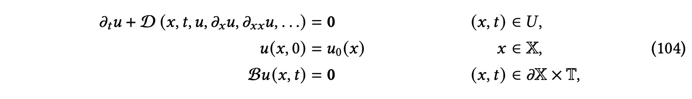

Chapter 0 在工程应用中ODEs/PDEs数值求解 

# framework
在PDE（偏微分方程）的数值求解中，存在两种常见的框架：Lagrangian（拉格朗日）框架和Eulerian（欧拉）框架。这两种框架在处理PDE问题时有不同的特点和应用场景。

Lagrangian框架是以物质粒子为基础的框架，其中物质粒子的位置和运动是关键。在Lagrangian框架中，偏微分方程的解是随着物质粒子的运动而变化的。这种框架适用于描述流体动力学问题，其中流体粒子的运动和相互作用是重要的。Lagrangian框架的优点是可以准确地追踪物质粒子的运动轨迹，适用于处理复杂的流体流动问题。

Eulerian框架是以固定的空间网格为基础的框架，其中偏微分方程的解是在空间网格上的函数。在Eulerian框架中，偏微分方程的解是随着时间和空间的变化而变化的。这种框架适用于描述传热、扩散、波动等问题，其中空间的分布和变化是重要的。Eulerian框架的优点是可以方便地应用数值方法进行离散化和求解，适用于处理各种类型的PDE问题。

在实际应用中，选择使用Lagrangian框架还是Eulerian框架取决于具体的问题和求解方法。一些问题可能更适合使用Lagrangian框架，例如流体动力学问题，而另一些问题可能更适合使用Eulerian框架，例如传热问题。此外，还有一些方法可以将Lagrangian框架和Eulerian框架结合起来，以充分发挥它们各自的优势。

总结起来，Lagrangian框架和Eulerian框架是PDE数值求解中常用的两种框架，它们分别以物质粒子和空间网格为基础，适用于不同类型的问题和求解方法。

在PDE数值求解中，Lagrangian framework和Eulerian framework是两种常用的方法。下面列举了它们分别包含的方法：

## Lagrangian framework（拉格朗日框架）：

粒子法（Particle Method）：将问题转化为跟踪粒子的运动轨迹，通过求解粒子的位置和速度来求解PDE。这种方法适用于流体动力学等问题，其中粒子代表流体的质点。
特征线法（Method of Characteristics）：通过跟踪特征线（characteristics）来求解PDE。特征线是PDE的解在时空域中的轨迹，通过求解特征线上的ODE来获得PDE的解。
有限元法（Finite Element Method）：将域划分为小的单元，通过在每个单元上构建适当的基函数来逼近PDE的解。在Lagrangian framework中，单元随着时间的推移保持不变，因此适用于求解随时间变化的问题。

## Eulerian framework（欧拉框架）：

有限差分法（Finite Difference Method）：将域划分为网格，通过在网格节点上使用差分格式逼近PDE的导数，从而求解PDE。在Eulerian framework中，网格保持固定，PDE的解随时间变化。
有限体积法（Finite Volume Method）：将域划分为离散的控制体积，通过在每个控制体积上进行质量、动量和能量守恒的积分来求解PDE。这种方法适用于守恒型方程的求解。
有限元法（Finite Element Method）：在Eulerian framework中，有限元法也可以用于求解PDE。在这种情况下，网格可以随时间变化，但是在每个时间步长内保持固定。
综上所述，Lagrangian framework和Eulerian framework在PDE数值求解中分别包含了粒子法、特征线法、有限元法等方法（Lagrangian framework），以及有限差分法、有限体积法、有限元法等方法（Eulerian framework）。

# eg.
数值偏微分方程（Numerical partial differential equations）是数值分析中研究偏微分方程（PDEs）数值解的分支。解决PDEs的数值技术包括以下几种方法：

1. 有限差分法（Finite Difference Method）：通过在特定网格点上表示函数，并通过这些值之间的差分来近似求导数。
2. 方法线（Method of Lines）：将除一个变量外的所有变量离散化，得到一个剩余连续变量的ODEs系统。
3. 有限元法（Finite Element Method）：通过基函数表示函数，并在其积分（弱）形式中求解PDEs。
4. 有限体积法（Finite Volume Method）：将空间划分为区域或体积，并通过考虑体积表面上的通量（流量）来计算每个体积内的变化。
5. 谱方法（Spectral Method）：将函数表示为特定基函数的和，例如使用傅里叶级数。
6. 无网格方法（Meshfree Methods）：不需要网格来工作，因此对于某些问题可能更适合。然而，计算工作量通常更大。
7. 域分解方法（Domain Decomposition Methods）：通过将边界值问题分解为子域上的边界值问题，并在子域之间进行迭代以协调解决方案来解决问题。
8. 多重网格方法（Multigrid Methods）：使用一系列离散化来解决微分方程。

有限差分法通常被认为是最简单的方法。有限元法和有限体积法广泛应用于工程和计算流体力学中，并且非常适用于复杂几何问题。谱方法通常是最准确的，前提是解足够平滑。

有限差分法和有限元法是常用的数值计算方法，用于求解微分方程。它们在离散方式、适应问题类型和精度等方面存在一些区别。

以下是有限差分法和有限元法的区别：

离散方式：
有限差分法：通过差分近似微分，将求解域划分为差分网格，用有限个网格节点代替连续的求解域，建立以网格节点上的值为未知数的代数方程组[1]。
有限元法：通过插值函数来近似微分，将求解域划分为有限个互不重叠的单元，在每个单元内选择合适的节点作为求解函数的插值点，将微分方程离散为线性表达式，借助变分原理或加权余量法进行求解[1]。
适应问题类型：
有限差分法：适用于线性的区域规则问题，常用于结构力学等领域[1]。
有限元法：适用于非线性和不规则区域问题，常用于结构力学和流体力学等领域[1]。
精度：
有限差分法：精度依赖于差分格式的阶数，可以使用一阶、二阶和高阶格式[2]。
有限元法：精度与完备性有关，一般比有限差分法的精度高，可以达到较高的精度

粒子方法（Particle Method）是一种基于粒子的数值解法，用于求解偏微分方程（Partial Differential Equations, PDEs）[1]。它是一种基于离散化的方法，将连续的问题转化为离散的粒子系统，通过模拟粒子之间的相互作用来近似求解PDEs。

粒子方法在PDE数值解法中有广泛的应用，特别适用于具有复杂几何形状和边界条件的问题。相比传统的网格方法，粒子方法具有以下优势：

适应性：粒子方法可以自适应地调整粒子的分布，以适应问题的特性和几何形状的变化。
高精度：粒子方法可以通过增加粒子的数量来提高数值解的精度，尤其在问题的局部区域需要更高的精度时。
易于处理复杂边界条件：粒子方法可以直接处理复杂的边界条件，而无需进行网格重构或插值操作。
并行计算：由于粒子之间的相互作用是局部的，粒子方法可以很容易地进行并行计算，提高计算效率。
然而，粒子方法也存在一些挑战和限制，例如粒子之间的相互作用的计算复杂度较高，需要考虑粒子的运动和相互作用的数值模拟方法等。

总之，粒子方法是一种重要的PDE数值解法，特别适用于处理具有复杂几何形状和边界条件的问题。

blow up time: u->oo

https://blog.csdn.net/liangwqi/article/details/133456160