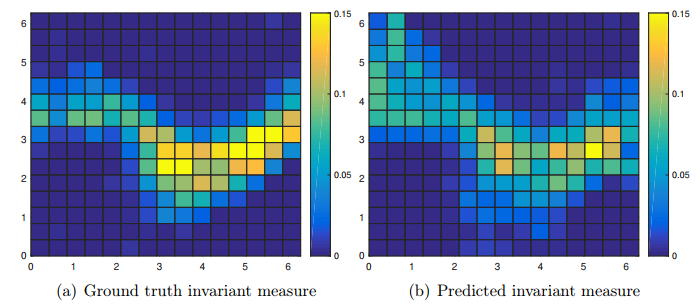
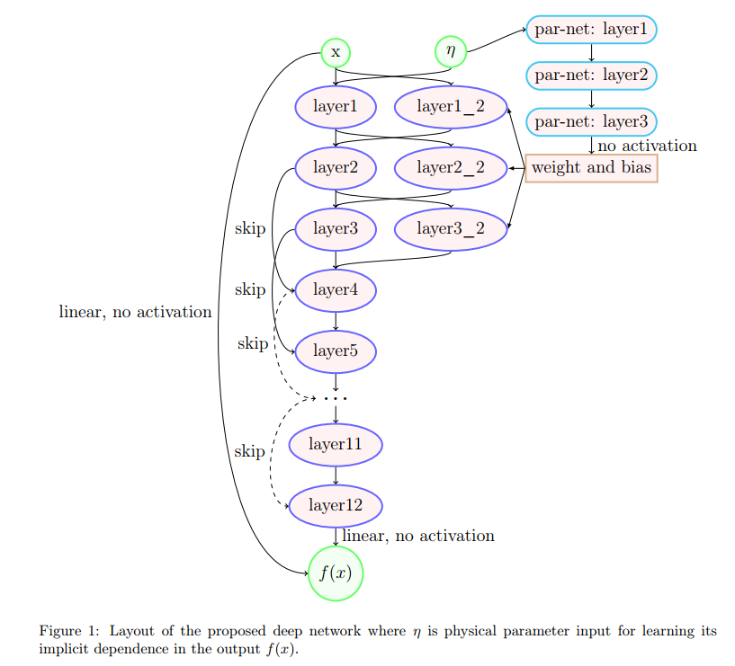
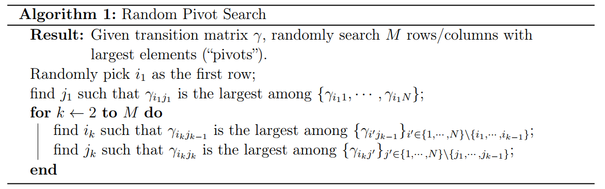
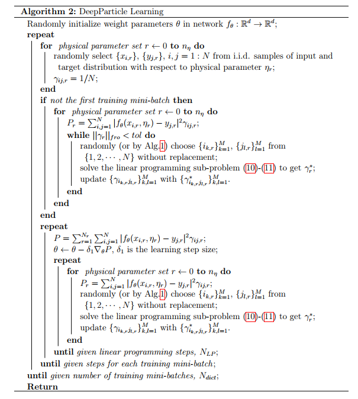
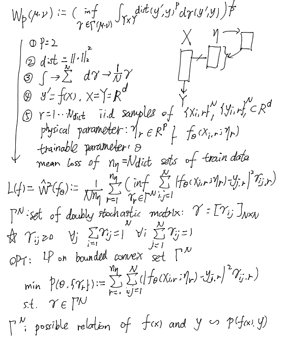
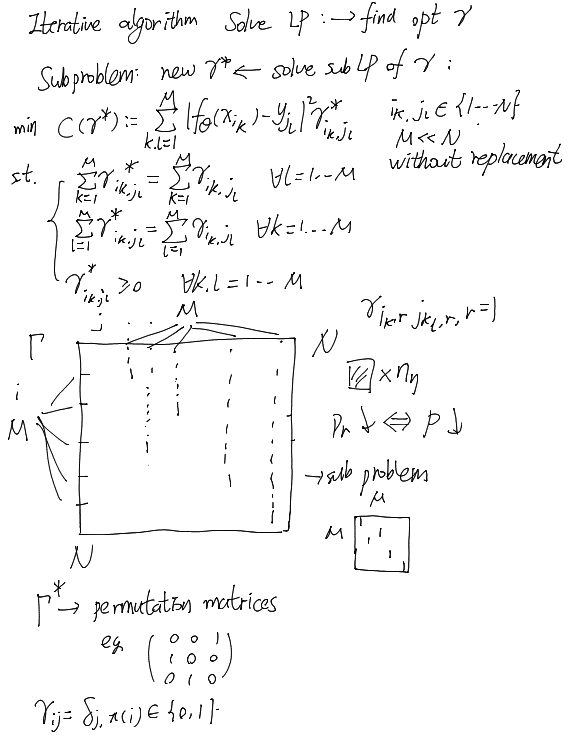
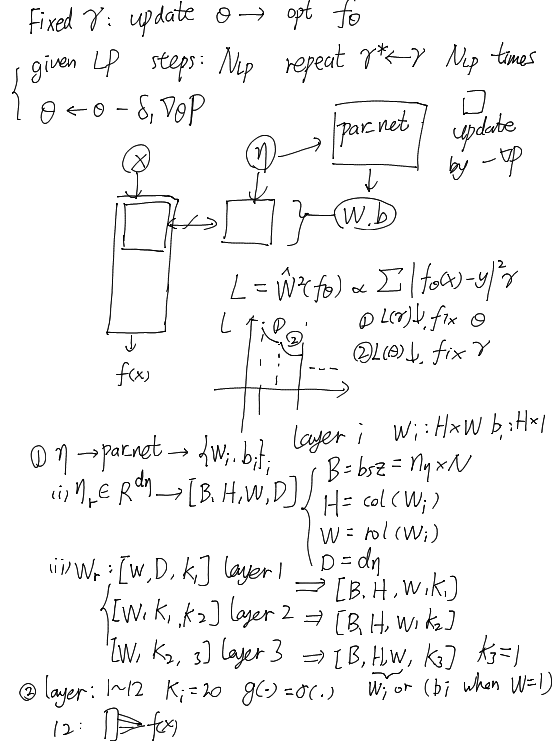

# background
具体问题：求解invariant measure

目前的解法：
交互粒子方法（Interacting Particle Method，IPM）是一种用于求解偏微分方程（Partial Differential Equation，PDE）的数值解法。它属于粒子方法（Particle Method）的一种。

粒子方法是一类基于离散粒子的数值计算方法，它将连续的物理问题离散化为离散的粒子集合，并通过模拟粒子之间的相互作用来近似求解连续问题。交互粒子方法是粒子方法的一种变体，它通过模拟粒子之间的相互作用来模拟和求解偏微分方程。

在交互粒子方法中，粒子之间的相互作用被建模为力、能量或其他物理量的交换。通过模拟粒子之间的相互作用，交互粒子方法可以近似求解各种类型的偏微分方程，包括椭圆型、抛物型和双曲型方程。

交互粒子方法在求解偏微分方程时具有一些优点。首先，它可以处理复杂的几何形状和边界条件，因为粒子可以自由移动和交互。其次，交互粒子方法可以自适应地调整粒子的密度和分布，以适应问题的特性和解的变化。此外，交互粒子方法还可以处理高维问题和多尺度问题。

然而，交互粒子方法也存在一些挑战和限制。例如，粒子之间的相互作用需要进行精确建模，并且计算复杂度较高。此外，粒子方法在处理高精度和长时间尺度问题时可能面临数值稳定性和计算效率的挑战。

综上所述，交互粒子方法是一种用于求解偏微分方程的数值解法，它通过模拟粒子之间的相互作用来近似求解连续问题。它在处理复杂几何形状、自适应调整和多尺度问题方面具有优势，但也面临一些挑战和限制。

# motivation
1. IPM从uniform到invariant measure的收敛时间长
2. DNN在生成分布上很有优势，可以数据驱动，拟合复杂问题, 训练好的端到端模型推理复杂度低。
3. 改进？
   - 如何将IPM和DNN结合起来？
   - 先用DNN(DPM)生成类似的invariant measure再用IPM精确求解

# methodology(eg.2D)
data: 
- uniform distribution, X:[H,W,C]
- hyper-parameters:physical parameter $\eta$, 对应微分方程的一些参数
- target distribution (generated by IPM), Y:[H,W,C]

model:2D->d=2
- input ${(x_{i,r}, η_r)}_i \in \mathbb{R^{d+p}}$,  $i = 1 \cdots N$, 坐标点padding物理参数
- output $f_\theta(x;η)$, $r = 1 \cdots N_{dict}$
- hypernetwork: input $\eta$, output $w$,$b$ of layer_k_2

Optimization:
solve: subproblem LP

