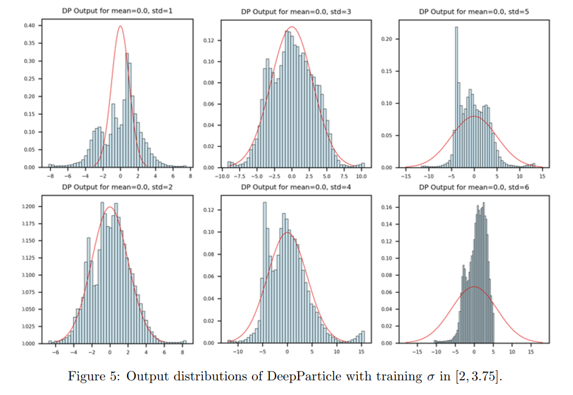
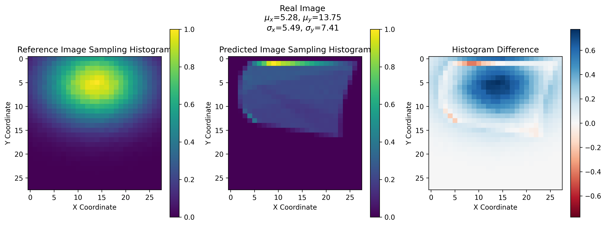

1. 一元高斯分布

比较上一届的



我的，表现良好，cpu，1h，8个分布
训练集


测试集，泛化较弱


2. mnist, cpu 5h, 10个数字，未完全


3. 二维高斯，聚集
  
WGAN_GP, + cGAN: 1h-2h
pretrain 1000 epoch, 
load model: 1000-2000


deep particle net: 1h-2h



问题：
1. 训练时间长，LP并行化，或者换个loss？，多图并行batch size。
2. 泛化不好，训练数据少？或者可能需要模型结构调整。
3. 基于粒子方法的数学理论和优化方法。收敛速度和GAN之类的比较。


GPU（图形处理单元）可以加速线性规划（Linear Programming, LP）的计算过程，尤其是在处理大规模问题时。以下是一些方法，说明如何利用GPU来加速线性规划：
1. **并行计算**：
   - **向量化和矩阵操作**：线性规划中涉及大量的向量与矩阵运算，GPU在并行执行这些操作方面非常高效。
   - **并行求解**：可以将线性规划问题分解为多个子问题，这些子问题可以在GPU上并行求解。
2. **专用库和工具**：
   - 使用专门为GPU优化的数学库，如cuBLAS、cuSolver等，这些库可以高效地执行线性代数运算。
   - 使用支持GPU加速的线性规划求解器，例如NVIDIA的AMGX或CLP（Coin-or Linear Programming）的GPU版本。
3. **算法优化**：
   - **内循环优化**：将算法中最内层的循环映射到GPU的线程上，以实现高度并行化。
   - **减少内存传输**：尽量减少CPU和GPU之间的数据传输，因为内存传输是耗时的操作。
4. **问题分解**：
   - **分块算法**：将问题分解成小块，并在GPU上并行求解这些小块。
   - **分布式求解**：在多个GPU上分布式求解，适用于非常大的问题。
5. **GPU架构适应性**：
   - **利用GPU架构**：理解GPU的架构特点，如多核结构、内存层次结构等，并相应地设计算法。
以下是具体实施的一些步骤：
### 选择合适的GPU加速库
- **cuBLAS**：NVIDIA的CUDA基本线性代数子程序库，提供了线性代数运算的GPU加速实现。
- **cuSolver**：NVIDIA的CUDA solver库，提供了线性方程组求解的GPU加速实现。
### 使用GPU加速的线性规划求解器
- **Gurobi with GPU Acceleration**：Gurobi是一个商业线性规划求解器，它提供了GPU加速选项。
- **COIN-OR's CLP with GPU**：CLP是开源的线性规划求解器，其GPU版本可以利用GPU加速。
### 实现和优化
- **数据布局**：优化内存访问模式，以减少内存访问延迟。
- **并行策略**：根据GPU的并行架构设计并行算法。
- **内存管理**：合理分配和使用GPU内存，避免内存瓶颈。
### 示例代码（伪代码）
```python
import numpy as np
import cusolver # NVIDIA的CUDA solver库
# 假设A, b, c是线性规划问题Ax <= b, maximize c^T * x的参数
A = np.random.rand(m, n)
b = np.random.rand(m)
c = np.random.rand(n)
# 将数据转移到GPU
A_gpu = cusolver.CUDAArray(A)
b_gpu = cusolver.CUDAArray(b)
c_gpu = cusolver.CUDAArray(c)
# 设置线性规划问题
lp_solver = cusolver.solver.LinearProgramming(A_gpu, b_gpu, c_gpu)
# 求解线性规划问题
solution = lp_solver.solve()
# 获取结果
x = solution.x
```
请注意，实际使用时需要根据具体的GPU和线性规划库的API进行适当的调整。此外，GPU加速通常在问题规模较大时效果更明显，对于小规模问题，GPU加速可能不会带来显著的性能提升。
