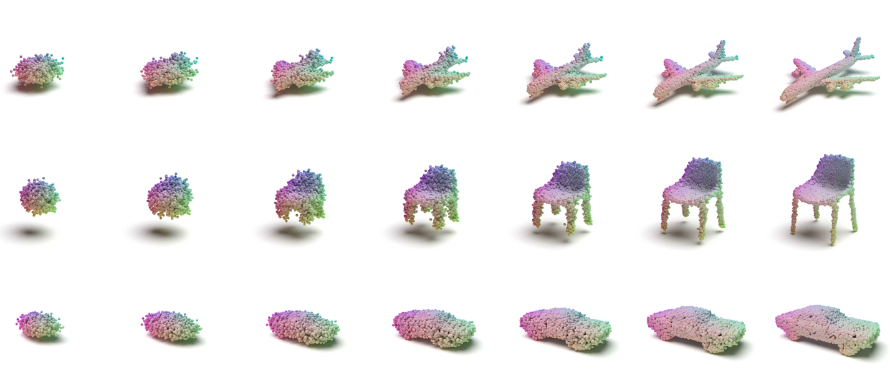
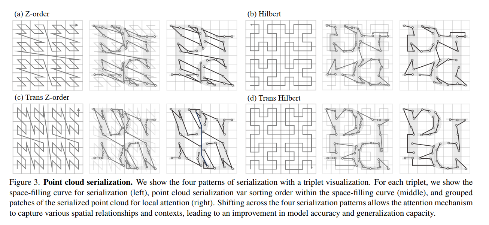
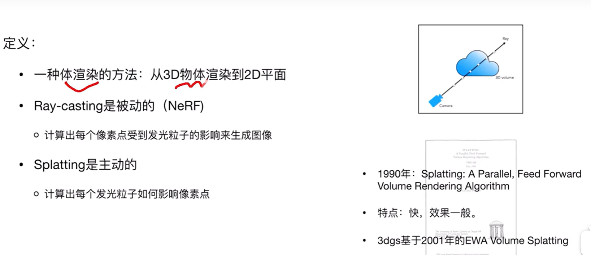
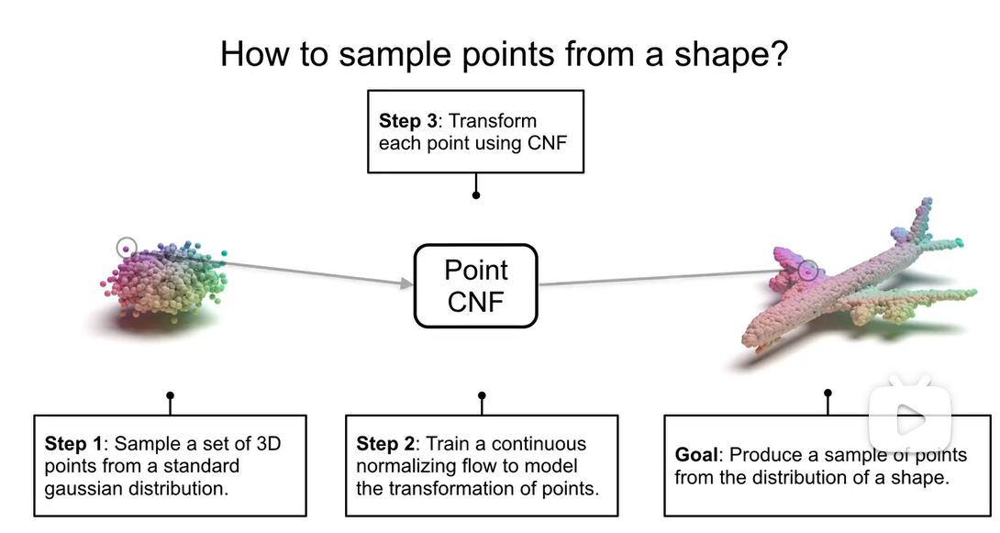

# DP 特色总结：
1. W2 Dist Wasserstein loss，ARBCD算法计算。
- Wasserstein距离(EMD) 确实有提供有效梯度的优点，目前的模型loss改成别的不好收敛。

- 但本身复杂度就是高，即使用了ARBCD也并不能很有效地减少，因为用到了线性规划算法有GPU优化问题，代码层面并不能有很好的优化（有些库代码能跑但是还是很慢，暂时没找到合适的库，一定要用最好是CUDA自己写需要的线性规划算法）。即使可以改掉线性规划，也不如换一种更高效的度量，或者用loss权重来减少EMD的计算次数。目前还没换，因为发现了其他方法并没有用这个距离。

2. 粒子坐标映射，输入输出都是坐标。

- 有其他方法也是粒子坐标映射，相比之下我们的网络结构简单，可以做很多修改。后续可以结合其他模型，有针对性的修改。**TODO**

- 无序点集，粒子类方法本身的问题。可能对粒子数比较敏感，泛化效果有待观察，内存占用大。这点其他的方法可能也没有解决。
  
3. 直方图统计方法，大量粒子坐标直方图统计，按分布缩放，得到概率分布。
- 直方图统计方法需要scale，可能更适合概率分布（浮点数，[0,1]，无穷维，scale误差小）而不是图像（整数，255，有较大的scale误差）。 
- 对任何类型数据，对粒子数最大值敏感，粒子聚集问题。比如，只有一个点粒子数最大值很大，那么直方图统计方法就不太好用了。原因是输入粒子的坐标很接近，神经网络学习的是连续的坐标映射，相近的点被映射后还是近的，如果神经网络不能区分就会聚集，想要能够区分，需要很充分的训练，对loss要求比较高 .eg L2(diff)

# 如何修改

## 已经有一些基于点集的方法
已经有了一些无序集合数据，如点云，把粒子坐标作为输入，训练神经网络。

3d -> 2d:
- **multi-view** 3d -> 2d: 3d == 2d * n views
- **pointcloud** point coordinate-based 不规则的 [C,N,3] (R,G,B), number of points, dimensions(x,y,z) -> ? point sets  [C,N,2] 往往规则长方形图片，不需要粒子表示法( ~= particle hist based) 
- **mesh** - topology-based  eg 法向量，三角形面片[C,N,3] -> 2d不需要? meshgrid transform
- **voxel**- tensor-based  [C,H,W,D] (R,G,B) -> pixel [C,H,W] (R,G,B)

1. 判别式模型,分类,分割： **PointNet, PointNet++**, DGCNN, PointTransformer

2. 三维重建, 3d-2d映射,相当于2d多视角生成,计算机图形学，光影光追：NeRF, 3DGaussian Splatting

3. 原生3d（pointcloud,mesh,voxel），点云生成，点云补全：PointGAN，**PointFlow**，PointGen，OccuNet

## 基于GAN的点云上采样方法，生成器生成新的点云数据
PUGAN（Point Cloud Upsampling with Generative Adversarial Networks）是一种基于生成对抗网络（GAN）的点云上采样方法。在点云处理中，上采样是一个重要任务，它涉及将稀疏点云数据扩展为更密集的点云。PUGAN通过生成对抗网络来实现这一目标，其中生成器负责生成新的点云数据，判别器则负责区分真实和生成的点云。
PUGAN的关键特点包括：
1. **生成对抗网络架构**：PUGAN使用GAN的架构，其中生成器生成新的点云数据，而判别器评估这些数据的真实性。
2. **上下文编码**：PUGAN使用上下文编码来捕捉输入点云的局部和全局信息，以指导生成器的生成过程。
3. **去噪网络**：PUGAN包含一个去噪网络，用于去除生成过程中引入的噪声，以提高生成的点云质量。
4. **多尺度特征学习**：PUGAN通过学习不同尺度的特征，能够生成具有不同分辨率和细节水平的点云。
PUGAN在多个点云上采样基准数据集上进行了评估，并取得了当时最先进（SOTA）的性能。然而，随着技术的发展，可能会有更多高效的点云上采样方法被提出。

## 生成点集数据
关于使用扩散模型（Diffusion Probabilistic Models）进行点云生成的研究
1. **《Diffusion Probabilistic Models for 3D Point Cloud Generation》**：这篇论文提出了一种用于点云生成的概率模型，这是3D视觉任务（如形状补全、上采样、合成和数据增强）的基础。该模型受非平衡热力学中扩散过程的启发，将点云中的点视为与热浴接触的热力学系统中的粒子，这些粒子从原始分布扩散到噪声分布。点云生成即学习将噪声分布转换为期望形状的逆扩散过程。该模型通过在某些形状潜在变量上建模逆扩散过程来描述，并推导出了用于训练的变分下界。
2. **《A Conditional Denoising Diffusion Probabilistic Model for Point Cloud Upsampling》**：这篇论文提出了一种用于点云上采样的条件去噪扩散概率模型（DDPM），称为PUDM。具体来说，PUDM将稀疏点云视为条件，并迭代学习密集点云和噪声之间的转换关系。同时，PUDM与双重映射范式对齐，以进一步提高点特征的辨识度。在实验结果中，PUDM在PU1K和PUGAN上的定量与定性评估中，在**Chamfer Distance（CD）和Hausdorff Distance（HD）**方面显著优于现有方法，实现了最先进（SOTA）的性能。
3. **《Enhancing Diffusion-based Point Cloud Generation with Smoothness Constraint》**：这篇论文提出了一种增强扩散基点云生成的方法，通过在扩散框架中引入局部平滑性约束来缓解反向扩散过程产生的非平滑点问题。实验结果表明，该模型能够生成更真实和更平滑的点云，优于多种最先进的方法。

## PointFlow

PointFlow是一种创新的3D点云生成模型，由Guandao Yang及其合作者于2019年提出。

- 这个模型的核心思想是将3D点云建模为分布的分布，即学习一个两级分布层次：第一级是形状的分布，第二级是给定形状的采样点的分布。learn the distribution of shapes, each shape itself being a distribution of points。这种提法使得既能对形状进行采样，又能对形状中的任意数量的点进行采样。
- PointFlow的生成模型通过一个连续的归一化流(NF)来学习每一级的分布。归一化流(NF)的可逆性使得在训练过程中可以计算似然(log-likelihood)，并使得在变分推理框架(VAE,ELBO)中训练模型成为可能。这种概率性的训练框架避免了训练GANs或手工制作良好的距离度量来测量两组点之间的差异的复杂性。

Here, we benefit from the fact that the invertibility of the continuous normalizing flow enables likelihood computation. This allows us to train our model end-to-end in a stable manner, unlike previous work based on GANs that requires two-stage training 

As a side benefit, we find the inference network learns a useful representation of point clouds in an unsupervised manner.

## 之后的研究方向
1. 继续我们的DP粒子直方图方法，在合适的数据集上应用，适当运用现有模型的方法来优化。有什么合适的连续分布？
- 例如用pointnet中对坐标的升维（upsampling）、CNN、Transformer。
- 优点：原创性高。
- 缺点：不确定性大，不能保证好结果，可能无法避免DP粒子直方图方法对训练难度高、对内存需求大的缺点。

2. 先用现有模型，再尝试把我们的粒子直方图方法放到某个模块里面或者其他理论优化。
- 优点：可能有一定的创新点，可行性较高，研究时间适中。
- 缺点：有一定的不确定性，可能需要大量实验，不能保证原创性（因为我们的方法可能不如现有的）

3. 直接基于现有的模型和方法，结合其他模型和方法，放弃直方图统计，只继承粒子坐标映射视角。可能可以引入创新点。
- 优点：可行性高，出成果概率比较大。
- 缺点：可能原创性不足，可能需要做到SOTA水平，需要大量实验，计算资源有限。

微分方程形式的网络？RNN，Transformer，Manba(Selected State M)，Normalizing Flow，扩散过程。一步一步运行模型，有一点state变化每一层不太一样。

