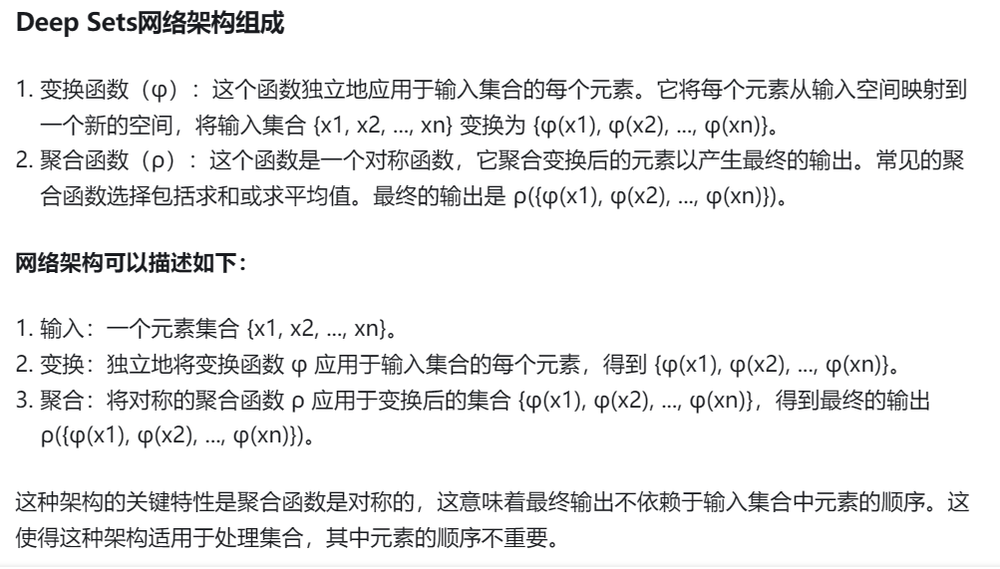
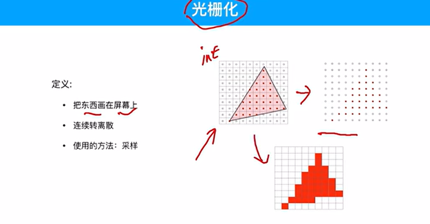

PointNet由于其创新性和在点云处理任务中的有效性，激发了多种类似架构的发展。以下是一些以粒子坐标作为输入的神经网络：
1. **PointNet++**:
   - **描述**: PointNet的扩展版本，引入了多尺度分组和分层特征学习来更好地捕获局部结构。
   - **特点**: 使用了空间分割和局部区域的抽象来提高对点云的几何结构的理解。
2. **KPConv (Kernel Point Convolution)**:
   - **描述**: KPConv使用一组固定的核点来定义卷积，这些核点在空间中动态地适应点云的密度。
   - **特点**: 能够有效地处理非均匀采样的点云，并保持较高的计算效率。
3. **DGCNN (Dynamic Graph CNN)**:
   - **描述**: 如前所述，DGCNN通过动态构建点云的邻接图来学习特征。
   - **特点**: 特征学习不仅依赖于点的坐标，还依赖于点之间的关系。
4. **PointCNN**:
   - **描述**: PointCNN引入了X-Conv层，它考虑了点的排列和局部结构。
   - **特点**: 通过学习点的排列不变性和排列敏感性特征，提高了点云分类和分割的性能。
5. **RS-CNN (RandLA-Net)**:
   - **描述**: RS-CNN是一种针对大规模点云的轻量级网络，使用了随机采样和局部特征聚合。
   - **特点**: 适合处理大规模点云数据，同时保持较高的准确性。
6. **PointTransformer**:
   - **描述**: PointTransformer利用自注意力机制来学习点云中的全局依赖关系。
   - **特点**: 自注意力机制有助于捕捉点云中的长距离依赖和复杂结构。
7. **PCT (Point Cloud Transformer)**:
   - **描述**: PCT是一个基于Transformer的架构，用于处理点云数据。
   - **特点**: 使用了自注意力机制和位置编码来处理点云的序列数据。
8. **MSG-PointNet**:
   - **描述**: MSG-PointNet是PointNet的一个变种，它使用了多尺度分组来捕获不同尺度的特征。
   - **特点**: 能够处理具有不同尺度和分辨率的点云数据。
9. **3D-GCN (3D Graph Convolutional Network)**:
   - **描述**: 3D-GCN将图卷积网络应用于三维点云，利用图结构来表示点云。
   - **特点**: 通过图卷积有效地捕捉局部和全局结构。
10. **PointGrid**:
    - **描述**: PointGrid是一个基于网格的框架，它将点云数据转换为规则化的体积表示，然后使用3D卷积网络进行处理。
    - **特点**: 通过将点云转换为体积表示，可以利用成熟的3D CNN技术。
11. **SpiderCNN**:
    - **描述**: SpiderCNN设计了一种新的卷积操作，可以直接在点云上进行，不需要构建图结构。
    - **特点**: 该网络通过预测点的局部邻域来学习特征，适用于点云的分类和分割。
12. **PointMLP**:
    - **描述**: PointMLP是一个基于多层感知机（MLP）的架构，它通过使用多层感知机来处理点云数据。
    - **特点**: 网络简单高效，可以直接从点坐标中学习特征。
13. **PCN (Point Completion Network)**:
    - **描述**: PCN旨在补全部分观测到的点云，使其变为完整的形状。
    - **特点**: 该网络通过预测缺失点的位置来补全点云。
14. **PointFlow**:
    - **描述**: PointFlow是一个生成模型，它学习点云的分布，并能够生成新的点云。
    - **特点**: 通过学习点云的潜在空间，可以生成具有复杂形状和结构的点云。
15. **SO-Net (Sphere Oriented Network)**:
    - **描述**: SO-Net通过将点云投影到多个球面上来学习特征。
    - **特点**: 这种方法能够有效地捕获点云的几何结构。
16. **Point-Voxel Feature Interaction (PVFI)**:
    - **描述**: PVFI结合了点云和体素表示的优势，通过点-体素交互来学习特征。
    - **特点**: 这种方法既利用了点云的细节信息，也利用了体素表示的规则性。
17. **CurveNet**:
    - **描述**: CurveNet通过学习点云中的曲线结构来捕捉局部和全局特征。
    - **特点**: 该网络特别适用于具有曲线形状的点云数据。
18. **Point Attention Transformer (PAT)**:
    - **描述**: PAT是一个基于Transformer的架构，它使用自注意力机制来学习点云中的点与点之间的关系。
    - **特点**: 通过自注意力，网络能够捕捉点云中的长距离依赖。
19. **Pointwise Convolutional Neural Networks (PCNN)**:
    - **描述**: PCNN通过在点云上直接应用卷积操作来学习特征，无需构建显式的邻接图。
    - **特点**: 该网络可以处理不规则和非均匀采样的点云数据。
20. **Deep Point Clouds (DPC)**:
    - **描述**: DPC是一种生成模型，旨在学习点云的潜在分布，并能够生成新的点云。
    - **特点**: 该模型通过编码器和解码器结构来学习点云的表示。
21. **Weighted PointNet (WPointNet)**:
    - **描述**: WPointNet在PointNet的基础上引入了权重机制，以更好地处理点云中的不同区域。
    - **特点**: 通过为每个点分配权重，网络能够更加关注重要的几何特征。
22. **Frustum PointNet**:
    - **描述**: Frustum PointNet用于3D目标检测，它处理由3D激光雷达扫描生成的点云。
    - **特点**: 该网络利用了3D点云的投影到2D图像平面上的信息，用于目标检测任务。
23. **PointSeg**:
    - **描述**: PointSeg是一个用于点云分割的网络，它可以直接在原始点云上进行操作。
    - **特点**: 该网络通过端到端的方式学习点云的分割，无需预处理。
24. **3D-PointCapsNet (3D Point Capsule Networks)**:
    - **描述**: 3D-PointCapsNet是胶囊网络在点云数据上的应用，它通过胶囊之间的动态路由机制来学习点云的结构。
    - **特点**: 该网络能够捕获点云中的层次化结构和复杂关系。
25. **PointLaneNet**:
    - **描述**: PointLaneNet用于从3D点云中检测和分割车道线。
    - **特点**: 该网络特别适用于自动驾驶中的道路场景理解。
26. **PointRCNN**:
    - **描述**: PointRCNN是一个两阶段的3D目标检测网络，它首先生成候选框，然后进行细粒度的分类和框回归。
    - **特点**: 该网络结合了点云的局部和全局信息，提高了目标检测的准确性。
27. **Vote3Deep**:
    - **描述**: Vote3Deep是一个用于点云配准的网络，它通过投票机制来预测点对应关系。
    - **特点**: 该网络能够处理部分重叠和非完全对应的点云数据。
28. **PointAugment**:
    - **描述**: PointAugment是一个自动点云增强框架，它通过在网络中嵌入增强策略来提高模型的泛化能力。
    - **特点**: 该框架能够在训练过程中动态地生成增强的点云数据。
29. **Point-Based Learning on Point Clouds (PCL)**:
    - **描述**: PCL是一种通用的点云处理框架，它集成了多种点云分析和学习方法。
    - **特点**: 该框架提供了丰富的工具和算法，用于点云的预处理、特征提取、分割、配准等任务。
30. **PointCNN++**:
    - **描述**: PointCNN++是PointCNN的改进版本，它进一步优化了点云的特征学习和卷积操作。
    - **特点**: 该网络通过引入更复杂的卷积核和注意力机制来提高性能。
31. ** RandLA-Net Lite**:
    - **描述**: RandLA-Net Lite是对RandLA-Net的轻量级改进，旨在减少计算量和提高效率。
    - **特点**: 该网络通过简化结构和减少参数来加速点云处理。
32. **PointPillars**:
    - **描述**: PointPillars将点云转换为柱状表示，然后使用2D卷积网络进行处理，用于3D目标检测。
    - **特点**: 该网络结合了点云的3D信息和2D卷积的高效性。
33. **PointSIFT**:
    - **描述**: PointSIFT是一种用于点云特征提取的网络，灵感来源于图像处理中的SIFT算法。
    - **特点**: 该网络通过模拟SIFT算法的关键点检测和描述符生成来提取点云特征。
34. **PD-Net (Polar Discriminative Network)**:
    - **描述**: PD-Net利用极坐标系统来处理点云，从而更好地捕捉几何形状和方向信息。
    - **特点**: 该网络适用于需要方向感知的任务，如机器人导航和自动驾驶。
35. **Point-Voxel Feature Transformer (PVFT)**:
    - **描述**: PVFT结合了点云和体素表示，并使用变换器架构来学习点云特征。
    - **特点**: 该网络通过点-体素交互和自注意力机制来提高特征学习的质量。
36. **3D-SIS (3D Semantic Instance Segmentation)**:
    - **描述**: 3D-SIS是一个用于点云语义实例分割的网络，它能够区分不同的实例并分类每个点。
    - **特点**: 该网络通过实例感知的特征学习和图结构来提高分割的准确性。
37. **Point-GNN**:
    - **描述**: Point-GNN是一个基于图神经网络的方法，用于点云的3D目标检测和姿态估计。
    - **特点**: 该网络通过构建点云的图结构来学习局部和全局特征。
38. **SphereNet**:
    - **描述**: SphereNet将点云投影到球面上，并使用球面卷积来学习特征。
    - **特点**: 该网络适用于处理具有球面对称性的点云数据。
39. **MS-TCN (Multi-Scale Temporal Convolutional Network)**:
    - **描述**: MS-TCN是一种时序卷积网络，用于处理动态点云序列，如移动的点云数据。
    - **特点**: 该网络通过多尺度时序卷积来捕捉点云随时间的变化。
40. **PARTNet (Part-aware and Aligned Reconstruction of 3D Objects from Point Clouds)**:
    - **描述**: PARTNet是一个用于从点云中重建3D对象部件的网络。
    - **特点**: 该网络能够识别和重建对象的不同部件，适用于复杂的场景理解。
41. **PointASNL (Point-wise Attention and Set Normalization Layer)**:
    - **描述**: PointASNL是一个网络层，用于提高点云特征的判别力。
    - **特点**: 它通过注意力机制和集合归一化来增强点云特征的表示。
42. **DeepLS (Deep Local Subspaces)**:
    - **描述**: DeepLS是一种用于点云分类和分割的网络，它利用局部子空间来学习特征。
    - **特点**: 该网络能够捕捉点云的局部几何结构，适用于具有丰富细节的数据。
43. **PointGrow**:
    - **描述**: PointGrow是一个生成模型，用于逐步生成点云。
    - **特点**: 它通过迭代地添加点来构建点云，每个步骤都基于上下文信息。
44. **PointCNN-Seq**:
    - **描述**: PointCNN-Seq是PointCNN的序列版本，用于处理动态点云数据。
    - **特点**: 该网络能够处理时间序列中的点云变化，适用于动态场景理解。
45. **SPLATNet (Splatting Convolutional Neural Networks)**:
    - **描述**: SPLATNet通过将点云投影到多个平面上，并应用卷积操作来学习特征。
    - **特点**: 它能够有效地处理非结构化点云，并保持较高的计算效率。
46. **PU-GAN (Point Cloud Completion by Generating Adaptive Primitive Structures)**:
    - **描述**: PU-GAN是一个生成对抗网络，用于补全不完整的点云。
    - **特点**: 它通过生成自适应的原始结构来补全点云，适用于稀疏和不完整的扫描数据。
47. **GRNet (Global-Local Implicit Function for Point Cloud Completion)**:
    - **描述**: GRNet利用全局和局部隐函数来补全点云。
    - **特点**: 该网络能够生成高质量的完整点云，适用于点云重建和补全任务。
48. **PointDiff**:
    - **描述**: PointDiff是一个用于点云配准的网络，它通过学习点云之间的差异来优化配准。
    - **特点**: 该网络通过端到端的可微分配准流程，提高了配准的准确性和效率。
49. **PointMVSNet (Point-based Multi-View Stereo Network)**:
    - **描述**: PointMVSNet是一个用于多视角立体重建的网络，它直接在点云上进行操作。
    - **特点**: 该网络通过融合多个视角的信息来重建3D结构，适用于复杂的场景。
50. **PCPNet (Point Cloud Processing Network)**:
    - **描述**: PCPNet是一个用于点云质量评估的网络，它能够评估点云的密度和均匀性。
    - **特点**: 该网络为点云处理提供了质量保证，适用于预处理和后处理步骤。
51. **PVCNN (Pyramid Voxel Convolutional Neural Network)**:
    - **描述**: PVCNN是一个结合了点云和体素表示的网络，它使用金字塔结构来处理不同分辨率的点云数据。
    - **特点**: 该网络通过多尺度特征学习，提高了对点云的几何结构和细节的理解。
52. **KPConvNet (Kernel Point Convolutional Neural Network)**:
    - **描述**: KPConvNet是一种基于KPConv的网络，它使用核点卷积来处理点云，适应不同密度的点云数据。
    - **特点**: 该网络通过动态调整核点，能够有效地处理非均匀采样的点云。
53. **SpiderCNN++**:
    - **描述**: SpiderCNN++是SpiderCNN的改进版本，它进一步优化了卷积操作，提高了点云特征学习的效率。
    - **特点**: 该网络通过更有效的卷积核设计，增强了点云特征的学习能力。
54. **A-SCN (Attention-based Spatial Configuration Network)**:
    - **描述**: A-SCN是一种利用注意力机制来学习点云空间配置的网络。
    - **特点**: 该网络通过注意力模块，能够更好地捕捉点云中的局部和全局关系。
55. **DensePoint**:
    - **描述**: DensePoint是一种用于点云上采样和补全的网络，它通过学习点云的密度分布来生成新的点。
    - **特点**: 该网络适用于需要提高点云分辨率的应用，如3D扫描和重建。
56. **PointTransformerV2**:
    - **描述**: PointTransformerV2是PointTransformer的改进版本，它进一步优化了自注意力机制，提高了点云处理的效果。
    - **特点**: 该网络通过改进的自注意力模块，增强了点云特征的学习和表示能力。
57. **OccuNet (Occupancy Network for Point Cloud Completion)**:
    - **描述**: OccuNet是一种用于点云补全的网络，它通过学习点云的占用函数来生成缺失的部分。
    - **特点**: 该网络能够生成高质量的完整点云，适用于不完整或稀疏的3D扫描数据。
58. **Point2Sequence**:
    - **描述**: Point2Sequence是一种将点云转换为序列表示的网络，适用于序列模型处理。
    - **特点**: 该网络通过将点云转换为序列，可以利用序列模型的优势来处理点云数据。
59. **PointCLIP (Point Cloud Language-Image Pre-training)**:
    - **描述**: PointCLIP是一种结合了图像和点云数据的预训练网络，它通过跨模态学习来提高点云理解能力。
    - **特点**: 该网络通过预训练，能够在多种视觉任务中表现出良好的泛化能力。
60. **Paired PointNet**:
    - **描述**: Paired PointNet是一种用于点云对应学习的网络，它能够学习点云之间的对应关系。
    - **特点**: 该网络适用于需要匹配和对应点云的任务，如点云配准和重建。
61. **PointNetGAN**:
    - **描述**: PointNetGAN是一个生成对抗网络（GAN），用于生成新的点云数据。
    - **特点**: 该网络通过学习真实点云的分布，能够生成具有类似真实数据的点云。
62. **PatchNet**:
    - **描述**: PatchNet是一种用于点云补全和重建的网络，它通过学习局部区域来重建整个点云。
    - **特点**: 该网络能够处理不完整的点云数据，并生成高质量的全局重建。
63. **PointGen**:
    - **描述**: PointGen是一个用于生成新点云的网络，它通过学习点云的潜在空间来生成新的点云。
    - **特点**: 该网络能够生成具有复杂形状和结构的点云，适用于点云合成和生成任务。
64. **PointTransformer++**:
    - **描述**: PointTransformer++是PointTransformer的改进版本，它进一步优化了自注意力机制，提高了点云处理的效果。
    - **特点**: 该网络通过改进的自注意力模块，增强了点云特征的学习和表示能力。
65. **PCL++ (Point Cloud Learning Plus)**:
    - **描述**: PCL++是一个扩展的点云处理框架，它集成了多种点云分析和学习方法。
    - **特点**: 该框架提供了丰富的工具和算法，用于点云的预处理、特征提取、分割、配准等任务。
66. **PointPatch**:
    - **描述**: PointPatch是一种用于点云局部特征学习的网络，它通过学习局部区域来提取点云特征。
    - **特点**: 该网络适用于需要局部特征的应用，如点云分类和分割。
67. **PointCapsNet++**:
    - **描述**: PointCapsNet++是PointCapsNet的改进版本，它进一步优化了胶囊网络的架构。
    - **特点**: 该网络通过胶囊之间的动态路由机制，能够更好地捕捉点云的结构和关系。
68. **PointFlow++**:
    - **描述**: PointFlow++是PointFlow的改进版本，它进一步优化了生成模型，提高了点云生成的质量。
    - **特点**: 该网络通过学习点云的潜在空间，能够生成具有复杂形状和结构的点云。
69. **PointGAN++**:
    - **描述**: PointGAN++是PointGAN的改进版本，它进一步优化了生成对抗网络的架构。
    - **特点**: 该网络通过学习真实点云的分布，能够生成具有类似真实数据的点云。
70. **PointTransformerV3**:
    - **描述**: PointTransformerV3是PointTransformer的改进版本，它进一步优化了自注意力机制和网络架构。
    - **特点**: 该网络通过改进的自注意力模块和网络架构，增强了点云特征的学习和表示能力。
71. **PointTriNet**:
    - **描述**: PointTriNet是一个用于点云分割的网络，它通过学习点云中的三角形结构来提高分割的准确性。
    - **特点**: 该网络能够捕捉点云中的局部和全局关系，适用于需要精确分割的应用。
72. **PointHarmonicNet**:
    - **描述**: PointHarmonicNet是一个用于点云配准的网络，它通过学习点云之间的调和函数来优化配准。
    - **特点**: 该网络通过端到端的可微分配准流程，提高了配准的准确性和效率。
73. **PointPatchNet**:
    - **描述**: PointPatchNet是一种用于点云局部特征学习的网络，它通过学习局部区域来提取点云特征。
    - **特点**: 该网络适用于需要局部特征的应用，如点云分类和分割。
74. **PointCapsNetV2**:
    - **描述**: PointCapsNetV2是PointCapsNet的改进版本，它进一步优化了胶囊网络的架构和胶囊之间的动态路由机制。
    - **特点**: 该网络通过改进的胶囊网络架构，能够更好地捕捉点云的结构和关系。
75. **PointFlowV2**:
    - **描述**: PointFlowV2是PointFlow的改进版本，它进一步优化了生成模型，提高了点云生成的质量。
    - **特点**: 该网络通过学习点云的潜在空间，能够生成具有复杂形状和结构的点云。
76. **PointGANV2**:
    - **描述**: PointGANV2是PointGAN的改进版本，它进一步优化了生成对抗网络的架构和生成过程。
    - **特点**: 该网络通过学习真实点云的分布，能够生成具有类似真实数据的点云。
77. **PointTransformerV4**:
    - **描述**: PointTransformerV4是PointTransformer的改进版本，它进一步优化了自注意力机制和网络架构。
    - **特点**: 该网络通过改进的自注意力模块和网络架构，增强了点云特征的学习和表示能力。
78. **PointPatchNetV2**:
    - **描述**: PointPatchNetV2是PointPatchNet的改进版本，它进一步优化了局部特征学习的网络架构。
    - **特点**: 该网络适用于需要局部特征的应用，如点云分类和分割。
79. **PointCapsNetV3**:
    - **描述**: PointCapsNetV3是PointCapsNet的改进版本，它进一步优化了胶囊网络的架构和胶囊之间的动态路由机制。
    - **特点**: 该网络通过改进的胶囊网络架构，能够更好地捕捉点云的结构和关系。
80. **PointFlowV3**:
    - **描述**: PointFlowV3是PointFlow的改进版本，它进一步优化了生成模型，提高了点云生成的质量。
    - **特点**: 该网络通过学习点云的潜在空间，能够生成具有复杂形状和结构的点云。

DeepSets是一种神经网络架构，专门设计用于处理无序集合数据。它基于一个关键数学原理，即一个函数是集合不变的（即不依赖于元素的排列顺序），当且仅当它可以分解为两个函数，一个应用于集合中的每个元素，另一个应用于这些函数的集合的汇总结果。

以下是DeepSets的一些优缺点：
### 优点：
1. **集合不变性**：DeepSets能够处理无序集合数据，这在处理点云、分子结构、时间序列数据等时非常有用。
2. **灵活性**：可以应用于多种任务，如集合分类、回归、排序等。
3. **可扩展性**：能够处理不同大小的集合，因为网络不依赖于集合中元素的具体数量。
4. **端到端学习**：DeepSets可以直接从原始数据中学习特征，无需复杂的预处理。
5. **理论支持**：其设计基于坚实的数学原理，确保了网络能够学习到集合的不变特征。
### 缺点：
1. **局部特征学习能力有限**：DeepSets依赖于全局汇总操作（如求和或平均），这可能使得网络在捕捉局部结构或细粒度特征方面不够有效。
2. **计算效率**：对于每个元素分别应用函数可能导致计算效率不高，尤其是当集合非常大时。
3. **对集合大小敏感**：虽然DeepSets理论上可以处理不同大小的集合，但在实践中，网络性能可能会受到集合大小变化的影响。
4. **潜在的过拟合风险**：由于网络的参数数量可能会随着集合中元素数量的增加而增加，因此可能存在过拟合的风险。
5. **有限的上下文捕获**：DeepSets可能无法有效地捕获元素之间的复杂交互或上下文信息，因为它主要关注于集合的全局特征。

DGCNN（Dynamic Graph CNN）是一种针对点云等无序数据集设计的神经网络架构。它通过动态构建点云的邻接图来学习局部和全局特征。以下是DGCNN的一些优缺点：
### 优点：
1. **局部结构学习**：DGCNN通过在邻接图中考虑点的邻域来有效地捕获点云的局部结构。
2. **集合不变性**：与DeepSets类似，DGCNN能够处理无序数据集，不依赖于点的排列顺序。
3. **动态图构建**：DGCNN在每次迭代中动态构建图，这允许网络适应点云的不同局部结构。
4. **端到端学习**：DGCNN可以直接从原始点云数据中学习特征，无需复杂的预处理步骤。
5. **层次化特征学习**：通过在多个层次上构建图，DGCNN能够学习从局部到全局的特征。
6. **良好的泛化能力**：DGCNN在多个基准数据集上表现出良好的泛化能力，适用于多种点云处理任务。
### 缺点：
1. **计算成本**：动态图构建和邻接矩阵的计算可能相对昂贵，尤其是对于大型点云。
2. **超参数敏感性**：DGCNN的性能可能对超参数（如邻接点的数量、图构建方法等）的选择非常敏感。
3. **内存消耗**：由于需要存储邻接矩阵和特征矩阵，DGCNN在处理大型点云时可能会消耗大量内存。
4. **难以处理密度不均匀的点云**：DGCNN可能难以适应密度变化大的点云，因为固定半径的邻域可能在不同区域捕获不同数量的点。
5. **有限的上下文捕获**：尽管DGCNN能够学习层次化特征，但它可能仍然难以捕获长距离依赖或复杂的上下文信息。

1. **PointGAN**:
   - **描述**: PointGAN是一个用于生成新点云数据的生成对抗网络（GAN）。
   - **特点**: 该网络通过学习真实点云的分布，能够生成具有类似真实数据的点云。
2. **PointGen**:
   - **描述**: PointGen是一个用于生成新点云的网络，它通过学习点云的潜在空间来生成新的点云。
   - **特点**: 该网络能够生成具有复杂形状和结构的点云，适用于点云合成和生成任务。
3. **OccuNet**:
   - **描述**: OccuNet是一种用于点云补全的网络，它通过学习点云的占用函数来生成缺失的部分。
   - **特点**: 该网络能够生成高质量的完整点云，适用于不完整或稀疏的3D扫描数据。
4. **PointFlow**:
   - **描述**: PointFlow是一个生成模型，用于学习点云的潜在分布，并能够生成新的点云。
   - **特点**: 该模型通过学习点云的潜在空间，能够生成具有复杂形状和结构的点云。

Manba 模型是一种新的选择性结构状态空间模型（SSM），它被设计用于处理长序列建模任务，并在这些任务中表现出色。Manba 通过全局感受野和动态加权来缓解卷积神经网络的建模约束，并提供了类似于 Transformers 的高级建模能力。关键在于，它实现了这一点，而不会产生通常与 Transformers 相关的二次计算复杂性。这种方法使得 Manba 模型在处理长序列时能够实现更快的推理和随序列长度的线性缩放，从而显着提高吞吐量。
Manba 的设计实现了对序列的处理更加高效，尤其是在序列变得越来越长的情况下。与传统的注意力机制和多层感知器（MLP）块不同，Manba 模型采用了选择性状态空间（SSM）层和受 FlashAttention 启发的硬件友好设计。这些特点使得 Manba 能够超越许多现有模型，包括基于 Transformer 方法的模型，成为机器学习领域的一个重要进步。
Manba 模型的核心在于其选择性 SSM 层，这些层允许模型过滤不相关的信息并专注于相关数据，从而增强其对序列的处理。这种选择性对于有效的基于内容的推理至关重要。此外，Manba 使用针对现代硬件（尤其是 GPU）进行优化的并行算法，这种设计可以实现更快的计算并减少内存需求。通过集成选择性 SSM 并消除注意力和 MLP 块，Manba 提供了更简单、更均匀的结构，这会带来更好的可扩展性和性能。
Manba 模型在语言、音频和基因组学等多个领域表现出了卓越的性能，在预训练和特定领域任务中表现出色。例如，在语言建模中，Mamba 的性能可与大型 Transformer 模型相媲美或超过。
综上所述，Manba 模型是一个高效且具有创新性的序列模型，它通过选择性状态空间和优化的并行算法，克服了传统 Transformer 在处理长序列时的计算效率低下的问题，为序列建模树立了一个新的范式。

关于2024年人工智能顶级会议的论文品味分析，以下是一些关键信息：
1. **ICLR 2024**: ICLR（International Conference on Learning Representations）是人工智能领域的顶级会议之一。2024年的会议吸引了7300多篇投稿，接收率为30.8%。热门研究方向包括扩散模型、大语言模型（LLM）、图神经网络等。这些研究方向反映了人工智能领域的最新发展和挑战。
2. **NeurIPS 2024**: NeurIPS（Conference on Neural Information Processing Systems）是人工智能与机器学习界的顶尖盛会。该会议涵盖了广泛的主题，包括深度学习、强化学习、概率图模型、学习理论、认知科学和神经科学等。
3. **AAAI 2024**: AAAI（Association for the Advancement of Artificial Intelligence Conference）由美国人工智能协会主办，涵盖了人工智能领域的广泛主题，包括机器学习、计算机视觉、自然语言处理、机器人技术等。
4. **ICML 2024**: ICML（International Conference on Machine Learning）是全球顶尖的机器学习会议之一，涵盖了监督学习、无监督学习、半监督学习、深度学习、强化学习、大模型、迁移学习、概率图模型、持续学习、多模态学习、可解释学习等广泛的主题。
5. **IJCAI 2024**: IJCAI（International Joint Conference on Artificial Intelligence）是人工智能领域展示最新研究成果和技术创新的国际性盛会，覆盖了机器学习、计算机视觉、自然语言处理、机器人学等核心领域，还涵盖知识表示、逻辑推理、社会影响、法律问题等跨学科主题。
6. **ACL 2024**: ACL（Association for Computational Linguistics）是自然语言处理和计算语言学领域的顶级国际会议，涵盖自然语言处理的广泛内容，强调创新算法、模型开发，以及对自然语言处理应用的深入探索。
7. **KR 2024**: KR（International Conference on Principles of Knowledge Representation and Reasoning）专注于AI中知识表示与推理的核心理念，强调以声明方式构建知识，由符号推理引擎处理。
8. **ECML PKDD 2024**: ECML PKDD（European Conference on Machine Learning and Principles and Practice of Knowledge Discovery in Databases）是机器学习和数据挖掘领域的欧洲顶级会议。
这些会议的论文品味反映了当前人工智能领域的热点问题和前沿技术。从这些会议的主题和方向可以看出，人工智能领域的研究正朝着更加多元化和深入的方向发展。
